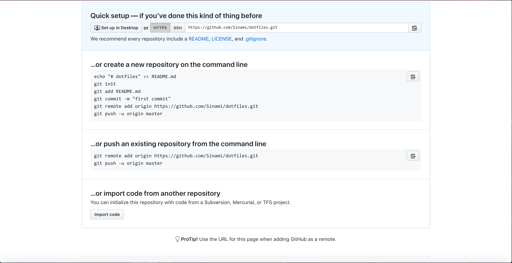
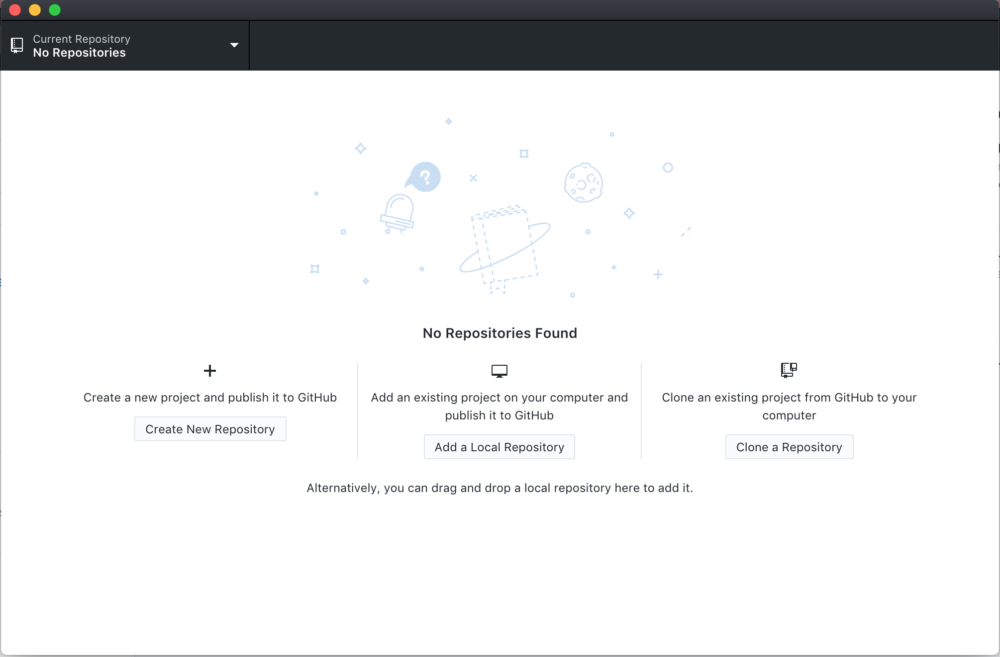

## Introduction to Opensource, Git, and Github

##### Opensource

---

Slideshare slides by Ali Yavari: [Intro to Opensource Slides](https://www.slideshare.net/ali_yavari/open-source-software-53045940)

##### Git

---

Windows: https://git-scm.com/downloads

Mac:

```shell
$ brew install git
```

Fedora Linux:

```shell
$ yum install git
```

Ubuntu/Debian:

```shell
$ apt-get install git
```

Resources:

http://ndpsoftware.com/git-cheatsheet.html

http://try.github.io/

##### Github

---

This is [Github](https://github.com).


A platform for hosting repositories, be it for opensource, personal, or business projects. Allows for easy collaboration between groups and integrating third party programs for automatic testing and code checks.

Starting a Repo on Github



Github Desktop

https://desktop.github.com/

Gives git a GUI that removes the need for terminal commands.





Github Student Developer Pack

[https://education.github.com/pack](https://education.github.com/pack)

The pack includes everything a beginning developer needs to explore different pipelines and setups. Can be renewed as long as student.

##### Survey

---

https://tinyurl.com/mccsurvey0

To get an idea of everyones skill level and they're interests.
